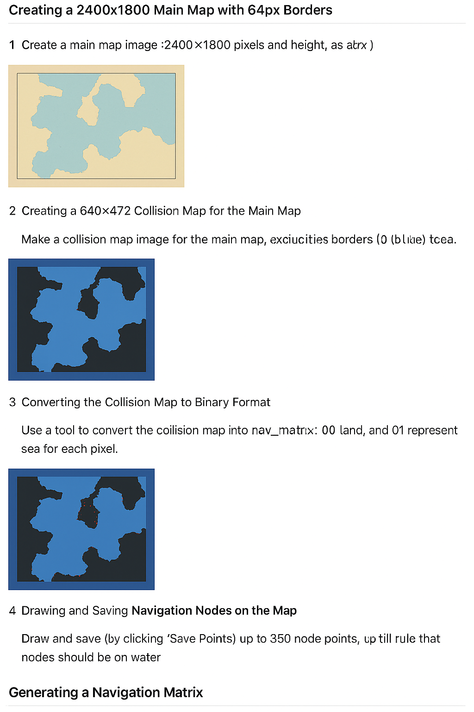

# 🌊 Nav Point Editor – Navigation Map Creation Guide

This guide explains how to create a **2D navigation map system** for water-based movement using the **Nav Point Editor** tool.

At the end of this process, you’ll have three essential binary files for your pathfinding system:

- **`nav_matrix.dat`** → the walkability map (land/water)
- **`nav_vec.dat`** → the list of navigation points (nodes)
- **`matrix_int.dat`** → the full connection and distance matrix between nodes

---

## 🗺️ 1. Create the Main Map

1. Create a main map image **2400×1800 pixels**.
2. Add **64px borders** on all four sides (usable area = 2272×1672).
3. Save as `main_map.png`.


---

## 🌊 2. Create the Collision Map

1. Create a **640×472** image.
2. Use:
   - **Black (0)** = Land
   - **Blue (1)** = Water
3. Exclude the 64px borders.
4. Save as `collision_map.png`.


---

## ⚙️ 3. Convert the Collision Map to Binary

Use a converter tool (or the provided script) to transform each pixel into binary values:

| Color | Binary |
|--------|--------|
| Black | 00 |
| Blue  | 01 |

Output → `nav_matrix.dat`


---

## 🧭 4. Draw Navigation Nodes

1. Launch **Nav Point Editor**.
2. Click to place nodes on **water only (blue)**.
3. Max ~350 nodes.
4. Right-click to remove or drag to move.


---

## 💾 5. Save Navigation Points

Click **Save Points** to generate `nav_vec.dat`.

Format:

```
[2 bytes]  Number of points
[2 bytes]  Padding
For each point:
  [2 bytes] X coordinate
  [2 bytes] Y coordinate
```

---

## 🔗 6. Generate the Navigation Matrix

Click **Generate Matrix** to create `matrix_int.dat` using Dijkstra’s algorithm.

Each pair (i, j) contains:

```
[4 bytes] Distance
[2 bytes] Next Node
```


---

## ✅ 7. Verify Connectivity

Use **Verify All** to ensure all nodes are reachable.

| Color | Meaning |
|--------|----------|
| 🔴 Red | Isolated node |
| 🟣 Purple | Unreachable node |
| 🟠 Orange | Weak connection |

---

## 🧩 Final Files

| File | Description |
|------|--------------|
| `nav_matrix.dat` | Walkability (land/water) |
| `nav_vec.dat` | Node list |
| `matrix_int.dat` | Distance matrix |

---

## 🛠️ Optional Conversion Script (Python)

```python
from PIL import Image
from tkinter import Tk, filedialog, messagebox
import os
import struct

def classify_pixel(r, g, b):
    """Classify the pixel as 0x00 (black) or 0x01 (blue)."""
    if (r + g + b) / 3 < 50:
        return 0x00
    elif b > r and b > g and b > 100:
        return 0x01
    else:
        return 0x00

def bmp_to_dat(bmp_path):
    """Convert a BMP image to a .dat binary file."""
    img = Image.open(bmp_path).convert("RGB")
    width, height = img.size
    pixels = list(img.getdata())

    # Prepare binary data with header (width + height)
    binary_data = bytearray()
    binary_data += struct.pack("<HH", width, height)  # 2 bytes each, little-endian

    for r, g, b in pixels:
        binary_data.append(classify_pixel(r, g, b))

    dat_path = os.path.splitext(bmp_path)[0] + ".dat"
    with open(dat_path, "wb") as f:
        f.write(binary_data)

    print(f"✅ Conversion complete: {dat_path}")
    messagebox.showinfo("Done", f"File saved as:\n{dat_path}")

def dat_to_bmp(dat_path):
    """Convert a .dat file back to BMP image."""
    with open(dat_path, "rb") as f:
        data = f.read()

    if len(data) < 4:
        print("❌ Invalid DAT file: too small to contain header.")
        return

    # Read width and height from header
    width, height = struct.unpack("<HH", data[:4])
    pixel_data = data[4:]

    expected_size = width * height
    if len(pixel_data) != expected_size:
        print(f"⚠️ Warning: pixel data size ({len(pixel_data)}) does not match {width}x{height} = {expected_size}")
        return

    img = Image.new("RGB", (width, height))
    pixels = img.load()

    for i, value in enumerate(pixel_data):
        x = i % width
        y = i // width
        if value == 0x00:
            pixels[x, y] = (0, 0, 0)       # black
        elif value == 0x01:
            pixels[x, y] = (0, 0, 255)     # blue
        else:
            pixels[x, y] = (255, 0, 255)   # magenta for unknown values

    bmp_path = os.path.splitext(dat_path)[0] + "_reconstructed.bmp"
    img.save(bmp_path)
    print(f"✅ Image reconstructed: {bmp_path}")
    messagebox.showinfo("Done", f"Image saved as:\n{bmp_path}")

def main():
    root = Tk()
    root.withdraw()

    choice = messagebox.askquestion(
        "Image Conversion",
        "Do you want to convert from BMP to DAT?\n(Choose 'No' for DAT → BMP)"
    )

    if choice == "yes":
        bmp_path = filedialog.askopenfilename(
            title="Select a BMP file",
            filetypes=[("Bitmap files", "*.bmp")]
        )
        if bmp_path:
            bmp_to_dat(bmp_path)
        else:
            print("No file selected.")
    else:
        dat_path = filedialog.askopenfilename(
            title="Select a DAT file",
            filetypes=[("DAT files", "*.dat")]
        )
        if dat_path:
            dat_to_bmp(dat_path)
        else:
            print("No file selected.")

if __name__ == "__main__":
    main()

```

---


