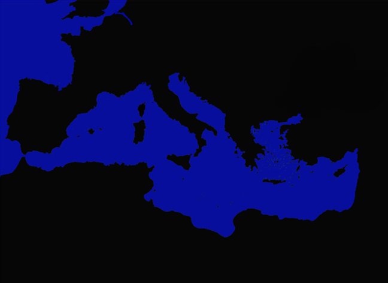
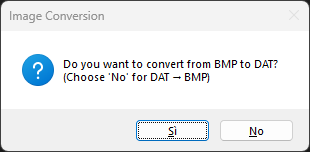
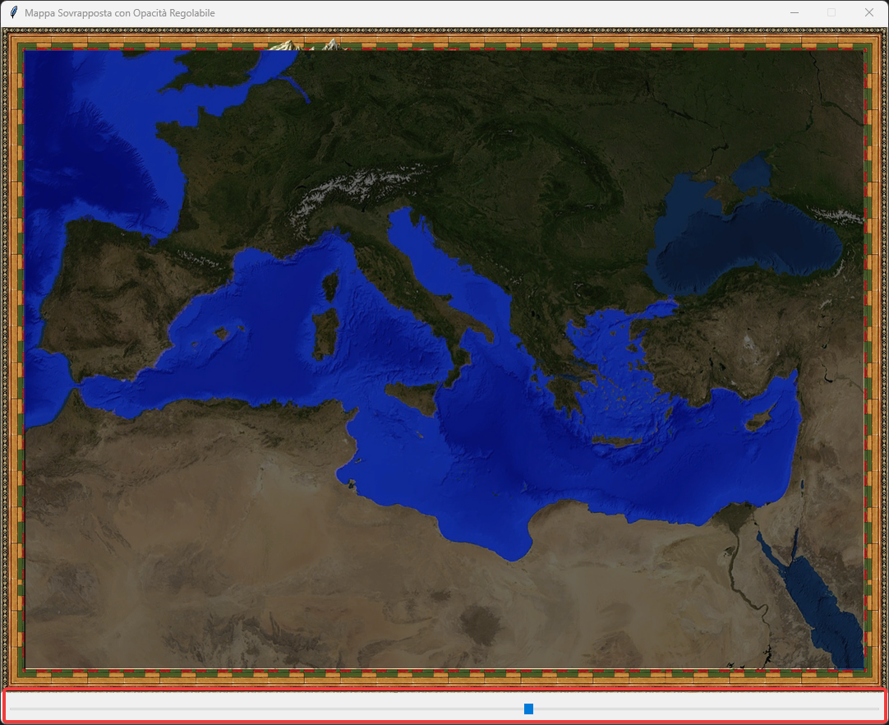
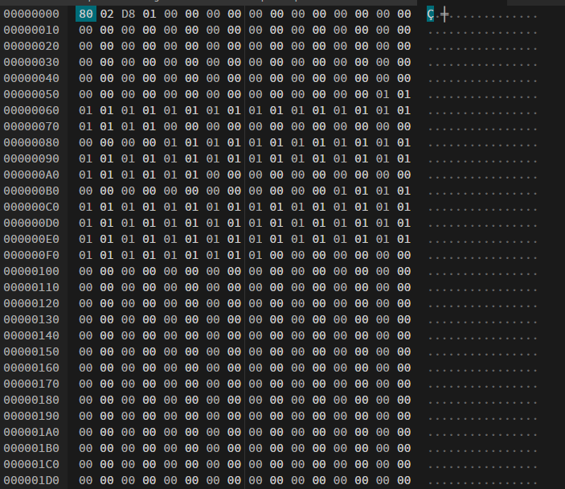
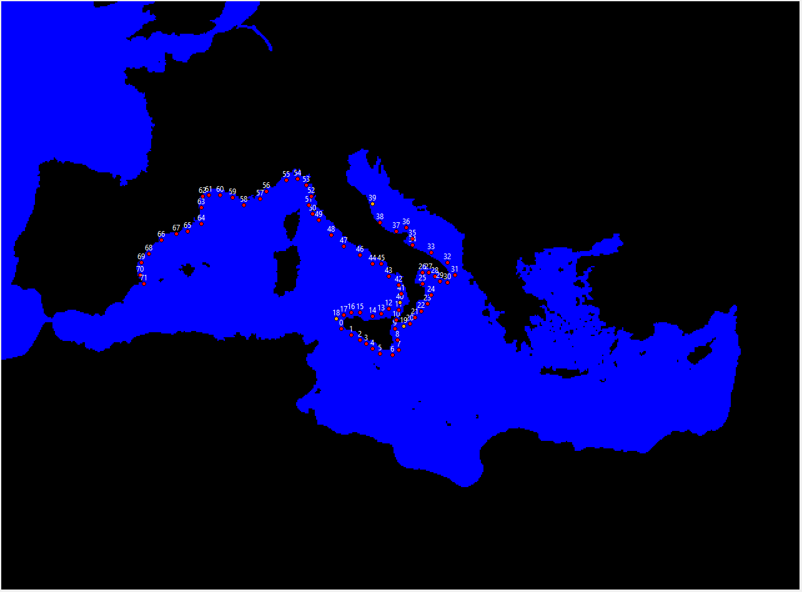
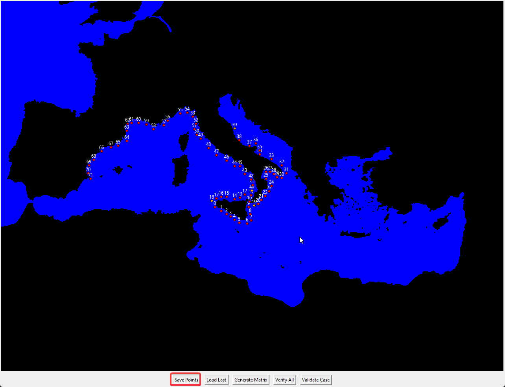
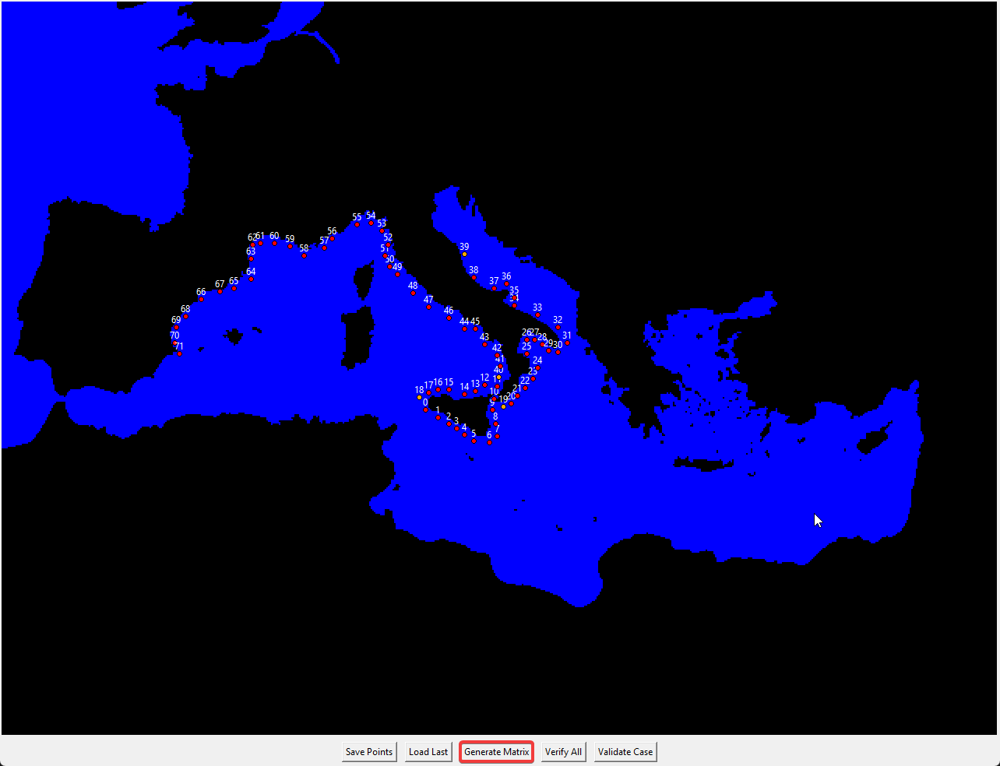
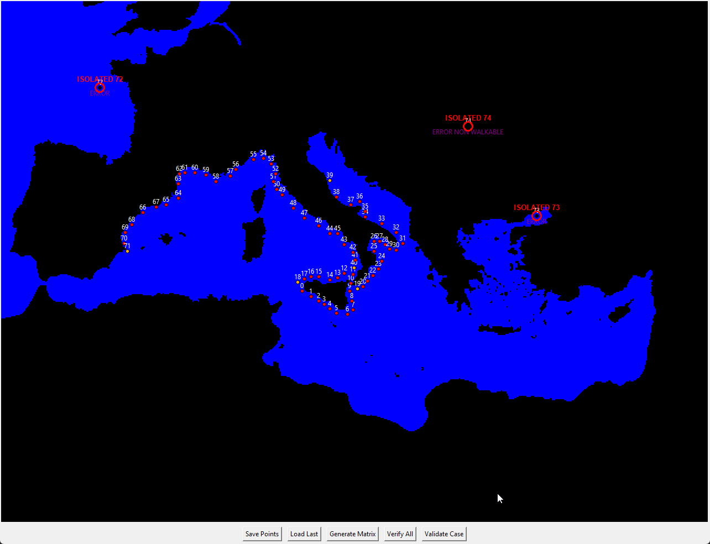

NEW MOTHOD!
# Quick Guide: Replacing Map and Navigation Data (Patrician 3)

This guide summarizes **Steps 1–6** shown in the images to regenerate and install:
- the **map** (BMP),
- the **collision map** converted into `nav_matrix.dat`,
- the navigation points `nav_vec.dat`,
- the distance/connection matrix `matrix_int.dat`,
- and the city INI `StadtDaten.ini`.

> **Important note:** always make a **backup** of the original files before replacing them.

---

## File structure (where to copy)

- `Patrician3\navdata\`  
  - `nav_vec.dat` (new points)  
  - `matrix_int.dat` (new distance/connection matrix)  
  - `nav_matrix.dat` (converted collision map)

- `Patrician3\scripts\`  
  - `StadtDaten.ini` (new city file generated by the tool)

---

## Step 1 — Create a 2400×1800 map with 64px borders

1. Prepare the new map image with size **2400×1800**.
2. Keep the **64px borders** (frame) included in the image.
3. Export as BMP.

✅ Expected output: a 2400×1800 map with a 64px border frame.

---

## Step 2 — Create the 640×472 collision map WITHOUT borders

1. Starting from the same playable area, generate the collision map **scaled down** to **640×472**.
2. **No borders** (so do NOT include the 64px frame).
3. Make sure you color as BLACK the Land, and as Blue the Water

✅ Expected output: a 640×472 collision image without borders.



---

## Step 3 — Convert the collision map into `nav_matrix.dat` using `ImgConv.py`

1. Run `ImgConv.py` on the **640×472** collision map.
2. The output must be **`nav_matrix.dat`**.

Quick checklist:
- Is the source really 640×472?

✅ Expected output: `nav_matrix.dat` ready.


---

## Step 4 — Export and replace `nav_vec` and `matrix_int` (and also `nav_matrix`)

Inside the nav editing/generation tool:

1. Load the file using **Load nav_matrix** → click **Generate Contour Points** using the recommended settings (**Spacing = 3**, **minDist from land = 4**).
2. Use **Export nav_vec** → generates `nav_vec.dat`.
3. Use **Export matrix_int** → generates `matrix_int.dat`.
4. Copy and **replace** in `Patrician3\navdata\`:
   - `nav_vec.dat`
   - `matrix_int.dat`
   - and **also replace** `nav_matrix.dat` (the one created in Step 3)

✅ Expected output: `Patrician3\navdata\` contains all 3 updated files.

---

## Step 5 — Move all cities onto the correct points (CityMapEditor)

1. Open **CityMapEditor**.
2. Load the BMP map (2400×1800) and the current INI (if you need it as a base).
3. Move each city to the correct position.

> **Note (from the images):** all cities must be placed on **water** or on a **non-collidable** part of the map.

Practical tips:
- Enable point visualization (if available) to avoid invalid areas.
- After each move, double-check that the icon/name is not placed on land/obstacles.

✅ Expected output: all cities correctly repositioned.

---

## Step 6 — Replace `StadtDaten.ini` with the one generated by the tool

1. From CityMapEditor (or equivalent tool), **generate/export** the new `StadtDaten.ini`.
2. Copy it into `Patrician3\scripts\`, replacing the existing one:
   - `Patrician3\scripts\StadtDaten.ini`

✅ Expected output: an updated `StadtDaten.ini` consistent with the new map.

---

## Final checks (recommended)

- The game starts without crashing.
- Cities are clickable and do not “sink” into invalid tiles.
- Sea routes can find paths (no total blockage).
- If routes become impossible:
  - check `nav_matrix.dat` (collision),
  - make sure `nav_vec.dat` does not contain disconnected clusters,
  - regenerate `matrix_int.dat` after any point edits.

---

## Backup (recommended)

Before replacing files, save a copy of the originals:

- `Patrician3\navdata\nav_vec.dat`
- `Patrician3\navdata\matrix_int.dat`
- `Patrician3\navdata\nav_matrix.dat`
- `Patrician3\scripts\StadtDaten.ini`

You can store them in a folder like:
`Patrician3\_backup_navdata_YYYYMMDD\`

---

## Mini-checklist “before launching the game”

- [ ] 2400×1800 map with 64px borders (BMP) OK  
- [ ] 640×472 collision map without borders OK  
- [ ] `nav_matrix.dat` generated by ImgConv.py OK  
- [ ] `nav_vec.dat` exported and copied into `navdata` OK  
- [ ] `matrix_int.dat` exported and copied into `navdata` OK  
- [ ] Cities repositioned (on water/non-collidable) OK  
- [ ] New `StadtDaten.ini` copied into `scripts` OK  

---

If you want, I can also:
- add a **Troubleshooting** section with common issues (crashes, invisible cities, blocked routes),
- or adapt the guide to your **exact** tool/file names (if they differ).


OLD METHOD!
# 🌊 Nav Point Editor – Navigation Map Creation Guide

This guide explains how to create a **2D navigation map system** for water-based movement using the **Nav Point Editor** tool.

At the end of this process, you’ll have three essential binary files for your pathfinding system:

- **`nav_matrix.dat`** → the walkability map (land/water)
- **`nav_vec.dat`** → the list of navigation points (nodes)
- **`matrix_int.dat`** → the full connection and distance matrix between nodes

---

## 🗺️ 1. Create the Main Map

1. Create a main map image **2400×1800 pixels**.
2. Add **64px borders** on all four sides (usable area = 2272×1672).
3. Save as `main_map.png`.


---

## 🌊 2. Create the Collision Map

1. Create a **640×472** image.
2. Use:
   - **Black (1)** = Land
   - **Blue  (0)** = Water
3. Exclude the 64px borders.
4. Save as `collision_map.bmp`.


5. Use **'CompImage.py'** tool to select the main map first, then the collision map, and overlay them to visually verify that both align correctly.



---

## ⚙️ 3. Convert the Collision Map to Binary

Use **'ImgConv.py'** converter tool to transform each pixel into binary values:

First 4 bytes:

[2 bytes] → Width = 640

[2 bytes] → Height = 472

Then:

| Color | Binary |
|--------|--------|
| Black | 00 |
| Blue  | 01 |

Output to be renamed in → `nav_matrix.dat` 



---

## 🧭 4. Draw Navigation Nodes

1. Launch **Mapmaker.py**.
2. Click to place nodes on **water only (blue)**.
3. Default ~350 nodes.
4. Right-click to remove or drag to move.



---

## 💾 5. Save Navigation Points

Click **Save Points** to generate `nav_vec.dat`.

Format:

```
[2 bytes]  Number of points
[2 bytes]  Padding
For each point:
  [2 bytes] X coordinate
  [2 bytes] Y coordinate
```

---

## 🔗 6. Generate the Navigation Matrix

Click **Generate Matrix** to create `matrix_int.dat` using Dijkstra’s algorithm.

Each pair (i, j) contains:

```
[4 bytes] Distance
[2 bytes] Next Node
```



---

## ✅ 7. Verify Connectivity

Use **Verify All** to ensure all nodes are reachable.

| Color | Meaning |
|--------|----------|
| 🔴 Red | Isolated node |
| 🟣 Purple | Unreachable node |
| 🟠 Orange | Weak connection |

If Everything is Okay nothing will happen,

If something is wrong:


---

## 🧩 Final Files

| File | Description |
|------|--------------|
| `nav_matrix.dat` | Walkability (land/water) |
| `nav_vec.dat` | Node list |
| `matrix_int.dat` | Distance matrix |

Move those files in navdata

Enjoy!
