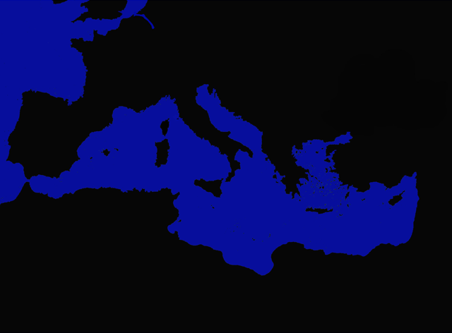

# 🌊 Nav Point Editor – Navigation Map Creation Guide

This guide explains how to create a **2D navigation map system** for water-based movement using the **Nav Point Editor** tool.

At the end of this process, you’ll have three essential binary files for your pathfinding system:

- **`nav_matrix.dat`** → the walkability map (land/water)
- **`nav_vec.dat`** → the list of navigation points (nodes)
- **`matrix_int.dat`** → the full connection and distance matrix between nodes

---

## 🗺️ 1. Create the Main Map

1. Create a main map image **2400×1800 pixels**.
2. Add **64px borders** on all four sides (usable area = 2272×1672).
3. Save as `main_map.png`.


---

## 🌊 2. Create the Collision Map

1. Create a **640×472** image.
2. Use:
   - **Black (0)** = Land
   - **Blue (1)** = Water
3. Exclude the 64px borders.
4. Save as `collision_map.png`.



---

## ⚙️ 3. Convert the Collision Map to Binary

Use a converter tool (or the provided script) to transform each pixel into binary values:

| Color | Binary |
|--------|--------|
| Black | 00 |
| Blue  | 01 |

Output → `nav_matrix.dat`


---

## 🧭 4. Draw Navigation Nodes

1. Launch **Nav Point Editor**.
2. Click to place nodes on **water only (blue)**.
3. Max ~350 nodes.
4. Right-click to remove or drag to move.


---

## 💾 5. Save Navigation Points

Click **Save Points** to generate `nav_vec.dat`.

Format:

```
[2 bytes]  Number of points
[2 bytes]  Padding
For each point:
  [2 bytes] X coordinate
  [2 bytes] Y coordinate
```

---

## 🔗 6. Generate the Navigation Matrix

Click **Generate Matrix** to create `matrix_int.dat` using Dijkstra’s algorithm.

Each pair (i, j) contains:

```
[4 bytes] Distance
[2 bytes] Next Node
```


---

## ✅ 7. Verify Connectivity

Use **Verify All** to ensure all nodes are reachable.

| Color | Meaning |
|--------|----------|
| 🔴 Red | Isolated node |
| 🟣 Purple | Unreachable node |
| 🟠 Orange | Weak connection |

---

## 🧩 Final Files

| File | Description |
|------|--------------|
| `nav_matrix.dat` | Walkability (land/water) |
| `nav_vec.dat` | Node list |
| `matrix_int.dat` | Distance matrix |

---

## 🛠️ Optional Conversion Script (Python)

```python
from PIL import Image
import struct

image = Image.open("collision_map.png").convert("RGB")
pixels = image.load()
width, height = image.size

with open("nav_matrix.dat", "wb") as f:
    f.write(struct.pack("<I", 0))
    for y in range(height):
        for x in range(width):
            r, g, b = pixels[x, y]
            f.write(b'\x01' if b > 128 and r < 100 and g < 100 else b'\x00')

print("nav_matrix.dat created.")
```

---


